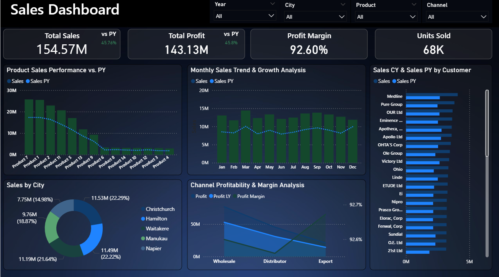

# 📈 Sales Strategy & Profit Optimization System
> **Turning transactional data into a high-performance decision-making engine.**

---

## 💼 1. Business Solutions & Value Delivery (Client-Centric)

When a business grows, complexity grows with it. Managers often find themselves "data-rich but insight-poor." This project was engineered to solve specific operational and financial challenges that hinder scalability.

### 🎯 Identifying Growth vs. Inflation
Many businesses see rising sales but fail to notice that their **Year-over-Year (YoY)** growth is slowing down. This dashboard provides an immediate "Health Check" by benchmarking current sales against historical performance, ensuring that growth is real and sustainable.

### 📉 Plugging Profit Leaks
Not every sale is a good sale. By integrating **Cost vs. Revenue** logic, I built a system that identifies high-revenue products with low-profit margins. This helps management decide whether to adjust pricing, negotiate with suppliers, or discontinue low-performing SKUs.

### 🚚 Logistics & Channel Efficiency
Businesses often waste resources on underperforming sales channels. My solution compares **Wholesale, Distributor, and Export** channels to reveal where the highest margins are hidden. This allows for smarter allocation of marketing and operational budgets.

### 🗺️ Geographical Expansion Intelligence
Instead of guessing which region to expand in next, the **City-Level Analysis** pinpoints exactly which territories are overperforming. Management can now study the "Success Blueprint" of a top city like **Christchurch** and replicate it in emerging markets.

---

## 🖥️ The Strategic Interface
<p align="center">
  
</p>
> [!TIP]
> **[🚀 Click Here to Explore the Interactive Live Dashboard](https://app.powerbi.com/view?r=eyJrIjoiZTBkZWEwOTEtYmI5Zi00M2ExLTk5MTYtYWY3MzA3YTJmY2E3IiwidCI6IjJiYjZlNWJjLWMxMDktNDdmYi05NDMzLWMxYzZmNGZhMzNmZiIsImMiOjl9)**

---

## ⚙️ 2. The Technical Blueprint (Engineering & DAX)

To provide the business solutions mentioned above, I engineered a high-performance backend. This section details the technical "engine" that powers the insights.

### 🏗️ Data Architecture & Modeling
* **Star Schema Implementation**: I organized the data into a centralized Fact Table (**Sales_Order**) surrounded by four Dimension Tables: **Products**, **Customers**, **Regions**, and a **Date Table**.
* **Relationships**: Established `1:Many` relationships using optimized Primary and Foreign keys to ensure lightning-fast filtering across all dashboard components.
* **Automated ETL**: Used **Power Query** to clean messy raw data and create calculated columns for row-level granularity, such as individual order costs and revenues.

### 🧪 Advanced DAX Programming (The Intelligence)
The dashboard relies on complex **DAX measures** to calculate performance in real-time. Below are the core formulas I developed:

#### 📉 Year-over-Year (YoY) Growth Engine
These measures allow the business to compare current performance against historical benchmarks:
* **Total Sales**: `Sales = SUM(Sales_Data[Sales])`
* **Previous Year Sales**: `Sales PY = CALCULATE([Sales], SAMEPERIODLASTYEAR(DateTable[Date]))`
* **Growth Variance**: `Sales vs PY = [Sales] - [Sales PY]`
* **Growth Percentage**: `Sales vs py % = DIVIDE([Sales vs PY], [Sales PY], 0)`

#### 💰 Profitability & Margin Analysis
To identify "Profit Leaks," I programmed these financial indicators:
* **Total Profit**: `Profit = SUM(Sales_Data[Profit])`
* **Previous Year Profit**: `Profit LY = CALCULATE([Profit], SAMEPERIODLASTYEAR(DateTable[Date]))`
* **Efficiency Metric**: `Profit Margin = DIVIDE([Profit], [Sales], 0)`

#### 📅 Master Date Intelligence (Time Engine)
I engineered a custom **Time Dimension Table** to support deep-dive chronological analysis:
```dax
DAX DateTable = 
ADDCOLUMNS (
    CALENDARAUTO(),
    "Year", YEAR([Date]),
    "Quarter", "Q" & FORMAT(CEILING(MONTH([Date])/3, 1), "#"),
    "Quarter No", CEILING(MONTH([Date])/3, 1),
    "Month No", MONTH([Date]),
    "Month Name", FORMAT([Date], "MMMM"),
    "Month Short Name", FORMAT([Date], "MMM"),
    "Month Short Name Plus Year", FORMAT([Date], "MMM,yy"),
    "Month sort", FORMAT([Date], "YYYYmm"), // Crucial for chronological sorting
    "DateSort", FORMAT([Date], "yyyyMMdd"),
    "Day Name", FORMAT([Date], "dddd"),
    "Details", FORMAT([Date], "dd-MMM-yyyy"),
    "Day Number", DAY ( [Date] )
)
